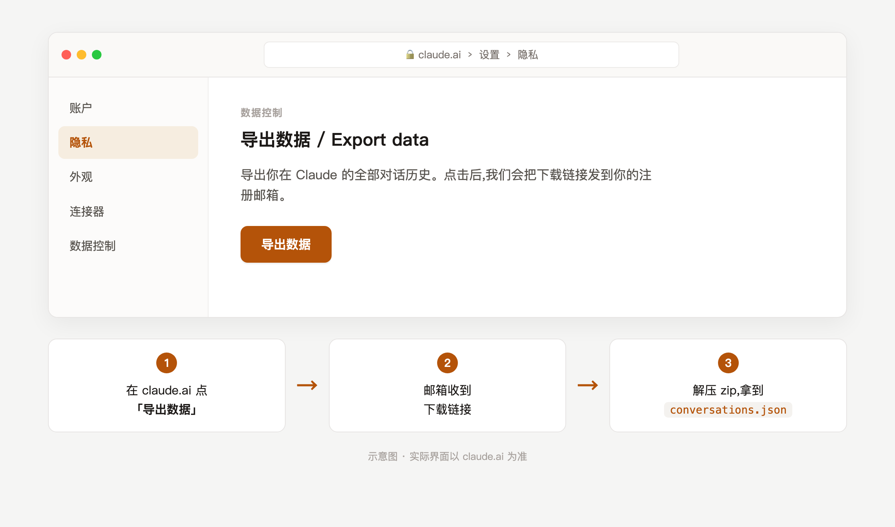
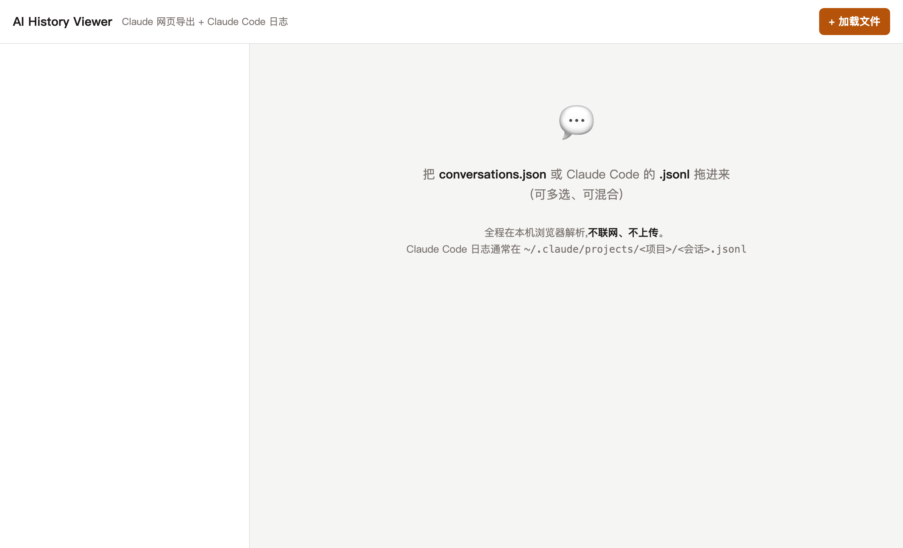
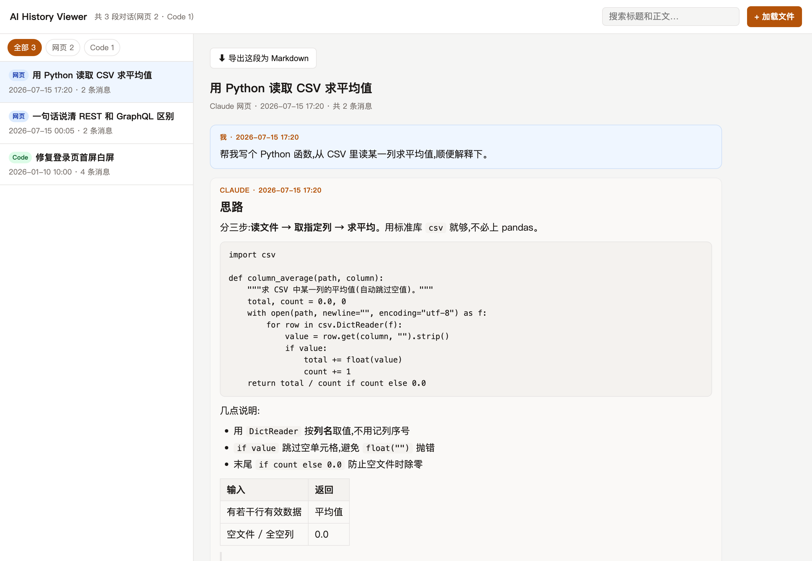

# AI History Viewer

把 **Claude 导出的聊天记录**重新还原成一条条可读的对话——单个 HTML 文件,双击就用,**纯本地、不联网、不上传**。

支持两种来源:

- **Claude 网页版数据导出** —— 在 claude.ai 申请「导出数据」后,邮件里那个 zip 解压出的 `conversations.json`
- **Claude Code 会话日志** —— 命令行版 Claude 的 `.jsonl`,通常在 `~/.claude/projects/<项目>/<会话>.jsonl`(Windows:`C:\Users\<用户名>\.claude\projects\…`)

## 三步上手

**① 从 Claude 导出聊天记录**

在 claude.ai 打开「设置 → 隐私」,点「导出数据」,邮箱会收到下载链接;下载并解压 zip,得到 `conversations.json`。(Claude Code 用户直接用 `~/.claude/projects/…/*.jsonl`,Windows 在 `C:\Users\<用户名>\.claude\projects\…`,可跳过这步。)



**② 拖进 AI History Viewer**

双击 `index.html` 打开,把 `conversations.json` 或 `.jsonl` 拖进页面(可多选、可混合)。全程在本机浏览器解析,**不联网、不上传**。



**③ 看到还原后的对话**

左侧按时间列出全部对话,右侧还原完整往来——Markdown、代码块、表格、列表原样渲染,支持全文搜索与一键导出 Markdown。



> 上图为**真实渲染效果**,对话内容为虚构演示。

## 功能

- **Markdown 渲染**:标题、列表、**粗体**、`行内代码`、代码块(带一键复制)、表格、引用、链接,原样还原 Claude 的排版
- **全文搜索**:标题 + 正文一起搜,侧栏给出命中片段并高亮
- **两种格式自动识别**:拖 `.json` 认网页导出,拖 `.jsonl` 认 Claude Code;可一次多选、混合加载
- **Claude Code 细节**:思考(thinking)、工具调用、工具结果、模型名都分区展示,可折叠
- **导出**:任意一段对话可一键导出成 Markdown 存档
- **深色模式**:跟随系统

## 用法

1. 下载本仓库的 `index.html`(单文件即可,不需要其余文件)
2. 双击用浏览器打开
3. 把 `conversations.json` 或 `.jsonl` 拖进去,或点右上角「加载文件」

### 找到 Claude Code 日志

```
macOS / Linux:  ~/.claude/projects/<把路径里的斜杠换成横线的项目名>/<会话-id>.jsonl
Windows:        C:\Users\<你的用户名>\.claude\projects\<项目名>\<会话-id>.jsonl
```

> Windows 提示:`.claude` 是隐藏文件夹,在资源管理器地址栏直接粘贴 `%USERPROFILE%\.claude\projects` 回车即可进入。

每个 `.jsonl` 是一次会话。可以一次把多个 `.jsonl` 一起拖进来。

## 隐私

所有解析都在你本机浏览器里完成,页面**没有任何网络请求**,你的聊天记录不会离开这台电脑。

## 已知边界

- 数据导出通常只含附件文件名、不含原图,所以图片显示为占位说明
- **ChatGPT 导出**(节点树 `mapping` 格式)会被识别但暂不支持渲染,已列入 roadmap
- 超大单段对话(数千条消息)会**分片渐进渲染**,不会冻结页面,但滚动可能偏重
- 内置的是**轻量 Markdown 渲染**,覆盖常见语法;个别边角(混合列表标记、setext 下划线标题、多级缩进嵌套列表)可能不完美,不影响阅读

## Roadmap

- [ ] ChatGPT 导出(`conversations.json` 的 mapping 树)文字级支持
- [ ] 直接拖 `.zip`,免手动解压
- [ ] 关联 `projects.json`,标注对话所属 Project

## 关于十页AI

本工具由 **[十页AI](https://shiyeai.cn)** 出品。更多 AI 工具、深度内容与超级指令,访问官网 👉 **[shiyeai.cn](https://shiyeai.cn)**

## 许可证

[PolyForm Strict License 1.0.0](LICENSE.md) —— 个人及非商业用途免费;**禁止商用**,**禁止分发或二次开发**。

© 2026 [十页AI工作室](https://shiyeai.cn)
